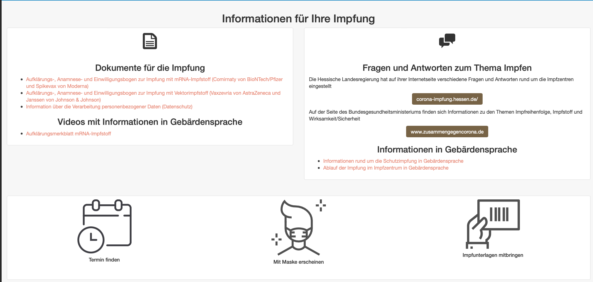
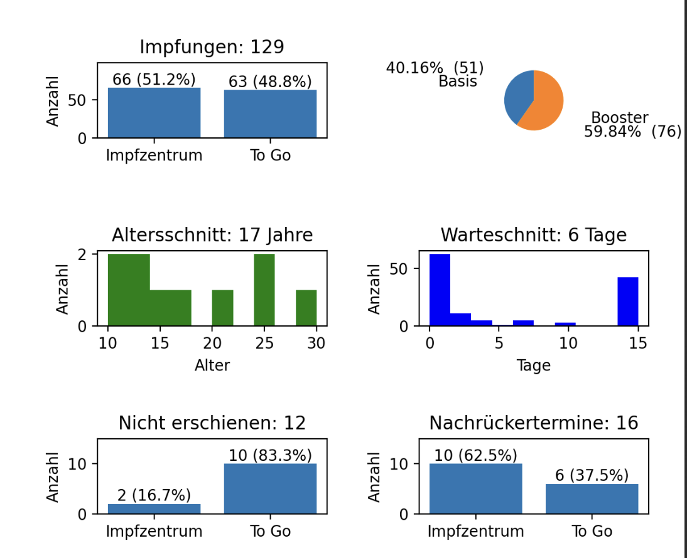

# Impfterminerfassung

Eine Open Source Lösung zur Bereitstellnung von Impfterminen. 

- Online Terminbuchung von Impfterminen für mehrere impfzentren/Stationen
- CSV Exportfunktion von Anmeldungen
- Reporting der geplanten Impfungen pro Station/Impfstoff
- Reporting der durchgeführten Impfungen pro Station/Impfstoff
- Statistiktool
- Automatische Löschung von personenbezogenen Daten nach erfolgter Durchführung


Bisher ist die Lösung sowohl für die Bereitstellung von Impfterminen als auch auf die Erfassung und Verarbeitung der Testergebnisse in den Testzentren des Odenwaldkreises optimiert. 

Die Komponenten sind jedoch flexibel genug gestaltet, dass auch andere Impfzentreuen/Testzentren damit betrieben werden können. Einzige Vorraussetzung ist ein Server mit LAMP Stack und TSL Zertifikaten.

[Schnelltesterfassung des DRK Odenwaldkreis](https://github.com/DRK-Odenwaldkreis/Testerfassung)

# Frontend

Das Frontend ist in php geschrieben. Aktuelle ist die Impfterminerfassung des Odenwaldkreises hier zu finden:  [Link](https://impfzentrum-odw.de/index.php)


Die Website bietet die Möglichkeit verfügbare Termine mehrerer Impfstoffe an mehrere Orten darzustellen und eine geführte Buchung dedizierter Termine durchzuführen.

## Hauptseite

Die Hauptseite ist unterglieder in allgemeine Informationen, z.B. aktuelle Anamnesebögen, Empfehlungen oder organisatorische Informationen.



## Terminkalender

Herzstück der Seite ist der Terminkalender, welche alle Stationen und Impfstoffangebote in einer Tagesansicht bündelt. hier werden freie Termine angezeigt.


## Kapazitätsplanung

Im internen Bereich können für alle Stationen geplant werden.


Hierbei kann ein Datum, eine optionale Adresse (sofern der Ort z.B. beim mobilen Impfen variiert) als auch der Durschsatz (x Impfungen pro 15 Minuten) angegeben werden. Auf Basis der Einträge werden die Termine dann in der Kalenderansicht angelegt und können gebucht werden.
## Terminbuchung

Freie Termine sind in der Kalenderansicht klickbar. Sobald alle Termine ausgebucht sind wird dies ebenfalls angezeigt.


Beim Auswählen des Tages der jeweiligen Statione werden alle verfügbaren Termine angezeigt.


Hierbei sind neben allgemeinen Ablaufinformationen auch die verfügbaren Slots wählbar.

In der Anmeldemaske werden nun alle relavanten Informationen der Person abgefragt.
Hierbei werden die Altersgrenzen und auch die erlaubten Postleitzahlgebite überprüft und ggf. Warnmeldungen angezeigt.


Nach der Registrierung wird eine Mail zur Verifizierung versendet, welche bestätigt werden muss. Nach erfolgter Verifizierung wird der Termin bestätigt und ist gebucht.


Am Tag der Impfung wird nochmals via Mail auf den Termin erinnert. In der Mail besteht die Möglichkeit den Termin zu stornieren.

## Terminbuchung Intern

Terminkontigente lassen sich mittels Passwort versehen, so dass diese z.B. nur fpr bestimmte Einrichtungen oder Unternehmen verwendet werden können. Auch kann dies z.B. von einer Hotline dazu verwendet werden Termine mit separatem Kontigent via Telefonanzubieten. Eine Mailadresse ist für interne Terminvergaben nicht verpflichtend. Hierbei entfällt dann der E-Mail Verifikationsschritt. Der Termin wird direkt gebucht.

## Voranmeldung

Im internen Bereich können die Voranmeldungen pro Tag eingesehen werden.


Die Anmeldung können hier sortiert und auch gefiltert werden. Darüber hinaus lassen sich Einträge löschen oder verändern. Auch kann hier angegeben werden, sobald die Person erschienen ist.

Die Liste lässt sich exportieren und wird als .xlsx zum Download zur Verfügung gestellt.
## Reporting

Aus den Informationen der Voranmeldung wird sowohl eine Planung für den kommenden Tag als auch ein Tagesprotokoll für den vergangenen Tag erstellt. Dieser beinhaltet visualle Aufbereitungen für die Planung vor Ort.



# Backend

## NightlyAutoClean

## Notification und Reminder

## Cleaner

## CSV Export

## Tagesreport

## utils
Hilfsfunktionen wie:

1. Mail senden
2. Schirftarten
3. Mailvorlagen
4. Konfiguration auslesen
5. Datenbank Connector


## MySQL Datenbank

Für die Persistierung wird eine MySQL Datenbank verwendet. Diese kann sowohl von einem Dienstleister in einem Rechenzentrum betrieben werden, als auch lokal auf dem Rechner des Terminals laufen. Je nachdem aus welchen Netzwerken Zugang zur Webapplikation benötigt würde, ist dies dementsprechend zu planen.

Für die Verwendung werden mehrere Tabellen benötigt.

###Gemeinden

Die Tabelle Gemeinden wird zu Folterung der erlaubten PLZ-Gebiete für die Terminvergabe verwendet.


```mysql
CREATE TABLE `Gemeinden` (
  `ID` int(11) NOT NULL,
  `PLZ` int(5) NOT NULL,
  `Gemeinde` varchar(50) NOT NULL,
  `Updated` timestamp NOT NULL DEFAULT current_timestamp() ON UPDATE current_timestamp()
) ENGINE=InnoDB DEFAULT CHARSET=utf8mb4;
```
### Impfstoff

Die tabelle Impfstoff wird für Informationen der verwendeten Impfstoffe verwenden, z.B. Bezeichnung und Mindestalter.

```mysql
CREATE TABLE `Impfstoff` (
  `id` int(11) NOT NULL,
  `Name` varchar(140) NOT NULL,
  `Kurzbezeichnung` varchar(50) DEFAULT NULL,
  `Mindestalter` int(11) DEFAULT NULL,
  `Aktiv` tinyint(1) NOT NULL DEFAULT 1,
  `Updated` timestamp NOT NULL DEFAULT current_timestamp() ON UPDATE current_timestamp()
) ENGINE=InnoDB DEFAULT CHARSET=utf8mb4;
```
### Station

In der Station wird hinterlegt, welche Öffnungszeiten bzw. welcher Impfstoff verwendet wird. Aktuelle ist die Zurodnung je eine Station pro Impfstoff.

```mysql
CREATE TABLE `Station` (
  `id` int(11) NOT NULL,
  `Ort` varchar(100) NOT NULL,
  `Adresse` varchar(100) NOT NULL,
  `Firmencode` varchar(32) DEFAULT NULL,
  `Oeffnungszeiten` varchar(100) DEFAULT NULL,
  `Impfstoff_id` int(11) NOT NULL DEFAULT 1,
  `Updated` timestamp NOT NULL DEFAULT current_timestamp() ON UPDATE current_timestamp()
) ENGINE=InnoDB DEFAULT CHARSET=utf8mb4;
```

### Termine

```mysql
CREATE TABLE `Termine` (
  `id` int(11) NOT NULL,
  `id_station` int(11) NOT NULL,
  `opt_station` varchar(36) DEFAULT NULL,
  `opt_station_adresse` varchar(64) DEFAULT NULL,
  `Tag` date DEFAULT NULL,
  `Stunde` int(2) DEFAULT NULL,
  `Slot` int(2) DEFAULT NULL,
  `Used` tinyint(1) DEFAULT NULL,
  `Startzeit` datetime DEFAULT NULL,
  `Endzeit` datetime DEFAULT NULL,
  `Updated` timestamp NOT NULL DEFAULT current_timestamp() ON UPDATE current_timestamp()
) ENGINE=InnoDB DEFAULT CHARSET=utf8mb4;
```

### Voranmeldung

In der Voranmeldung werden die Buchungen gespeichert, nachdem Sie zuvor in der Voranmeldung_Verif nach bestätigung der Mailadresse validiert wurden.

```mysql
CREATE TABLE `Voranmeldung` (
  `id` int(11) NOT NULL,
  `Token` varchar(40) DEFAULT NULL,
  `Mailsend` tinyint(4) NOT NULL DEFAULT 0,
  `Anmeldezeitpunkt` datetime NOT NULL DEFAULT current_timestamp(),
  `Vorname` varchar(40) NOT NULL,
  `Nachname` varchar(100) NOT NULL,
  `Telefon` varchar(50) DEFAULT NULL,
  `Mailadresse` varchar(50) DEFAULT NULL,
  `Geburtsdatum` varchar(25) DEFAULT NULL,
  `Booster` tinyint(1) DEFAULT NULL,
  `Tag` date NOT NULL,
  `Termin_id` int(11) DEFAULT NULL,
  `Used` int(11) NOT NULL DEFAULT 0,
  `Reminded` tinyint(4) NOT NULL DEFAULT 0,
  `Updated` timestamp NOT NULL DEFAULT current_timestamp() ON UPDATE current_timestamp()
) ENGINE=InnoDB DEFAULT CHARSET=utf8mb4;

CREATE TABLE `Voranmeldung_Verif` (
  `id` int(11) NOT NULL,
  `Token` varchar(100) NOT NULL,
  `id_preregistration` int(11) NOT NULL,
  `Updated` timestamp NOT NULL DEFAULT current_timestamp() ON UPDATE current_timestamp()
) ENGINE=InnoDB DEFAULT CHARSET=utf8mb4;
```

